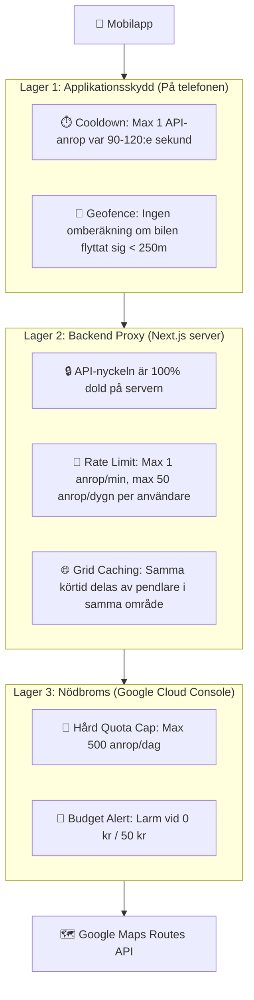

# 🚀 Monetization, Anti-Spam & Scaling Roadmap

Detta dokument beskriver arkitekturen, intäktsmodellen och säkerhetsåtgärderna för framtida utrullning av **Färjetidtabell** på Google Play och Android Auto.

---

## 🧭 1. Vision & Kärnfilosofi

Appens grundfilosofi är att erbjuda maximal nytta för lokala bilister och pendlare utan onödig friktion:
* **Alltid 100% gratis i grunden:** Ingen ska behöva betala för att se när färjan går eller om det är kö på väg 155.
* **Premium som en bekvämlighet:** De som vill ha den automatiska GPS-assistenten (som beräknar restid från garageuppfarten och rekommenderar exakt färjeavgång) kan låsa upp den till priset av en kopp kaffe.

---

## 💎 2. Nivåindelning (Freemium-modell)

### 🟢 Gratisnivå (Free Forever)
* **Källor:** 100% Trafikverket & Färjerederiet öppen data (kostar 0 kr i API-avgifter).
* **Funktioner:**
  * Live tidtabell för alla leder (Hönöleden, Björköleden, Svanesundsleden, Gullmarsleden).
  * Trafikverkets köprognoser vid färjeläget (*"Fri väg (0 min kö)"* / *"Bilkö 8 min ➔ Ta 2:a färjan"*).
  * Vägkarta med hastigheter och köstatus för båda körfält.
  * Live trafikkameror (CCTV) från Väg 155.
  * Fullt Android Auto-stöd i bilen.
  * Möjlighet till manuell "Bring Your Own Key" (BYOK) för tekniska användare.

### ⭐ Premiumnivå ("Smart Pendlare")
* **Källor:** Google Maps Routes API (Realtidstrafik).
* **Funktioner:**
  * **Personlig körtidsberäkning:** Live körtid från bilens unika GPS-position direkt till färjeläget.
  * **Smart avgångsmatchning:** Flaggar automatiskt vilken färjeavgång du hinner med (*"DU HINNER 14:35 (+7 min marginal vid kajen)"*) och dämpar avgångar du missar.
  * **One-Tap Navigering:** Direktväg till rätt färjebom i Google Maps på bilens skärm.
  * **(Framtida) Smarta aviseringar:** Pushnotis när det är dags att åka för att hinna med en specifik färja.

---

## 💳 3. Betallösningar, Rabatter & Gratisåtkomst

### Rekommenderad lösning: **RevenueCat + Google Play Billing**
* Google kräver **Google Play In-App Billing** för digitala funktioner i Google Play-appar.
* [RevenueCat](https://www.revenuecat.com/) är branschstandard för Android/Compose:
  * Hanterar kvitton, prenumerationer och återställning av köp vid telefonbyte.
  * Gratis tills appen omsätter över 25 000 kr/månad ($2 500/mån).
  * Har färdiga Jetpack Compose UI-komponenter för Paywalls.

### 🏷️ Kampanjer, Rabatter & Tidsbegränsade erbjudanden
1. **Introduktionserbjudande:**
   * T.ex. *"Testa gratis i 14 dagar"* eller *"50% rabatt första året"* (stöds direkt i Google Play Console och RevenueCat).
2. **Säsongskampanjer:**
   * Rabatt under sommartidtabellen eller skolstarten i augusti via tidsbegränsade prenumerationspriser.
3. **Kampanjkoder (Promo codes):**
   * Skapa koder i Google Play Console som ger t.ex. 1 år gratis eller livstidsåtkomst.
   * Perfekt för att dela ut i lokala Facebook-grupper, till grannar eller till testpiloter.

### 🎁 Gratis för utvalda användare (VIP, Vänner & Familj)
Det finns tre enkla sätt att ge permanent gratis åtkomst till utvalda personer utan att de behöver betala:
1. **Google Play Licenstestare:** Lägg till deras Gmail i Google Play Console ➔ De kan "köpa" premium för 0 kr.
2. **RevenueCat Dashboard Entitlements:** I RevenueCats kontrollpanel kan du söka upp en användare och klicka *"Grant Promotional Access"* på livstid eller i X månader.
3. **Lokal hemlig upplåsningskod:** En dold funktion i appen (t.ex. tryck 5 gånger på logotypen) där man kan knappa in en hemlig kod som sätter `isPremium = true`.

---

## 🛡️ 4. Anti-Spam & Kostnadskontroll (3 Skyddslager)

För att säkerställa att ingen elakartad användare eller spam-loop kan tömma utvecklarens Google Cloud-krediter används tre skyddsnivåer:

### Detaljerad skyddsspecifikation:
1. **Klient-cooldown (Lager 1):**
   * Om användaren hamrar på "Uppdatera" visas det senast sparade resultatet i minnet om det är färskare än 90 sekunder. Noll nätverksanrop görs.
   * Om bilen står stilla på samma GPS-koordinat görs ingen ny ruttförfrågan vid periodiska uppdateringar.
2. **Backend Proxy & Grid Cache (Lager 2):**
   * Mobilappen skickar aldrig Google-nyckeln. Appen anropar din egen server: `POST /api/driving-eta { lat, lng }`.
   * Servern validerar att användaren har aktiv premium (via RevenueCat-kvitto).
   * **Grid Cache:** Servern avrundar koordinater till närmaste 500 meter. Om 20 personer startar från Torslanda runt kl 07:30 görs endast **1 anrop till Google Maps**, och samma körtid svaras till alla 20. Det kapar 95% av kostnaden.
3. **Google Cloud Quota (Lager 3):**
   * Oavsett vad som händer i appen eller på internet sätter du en hård gräns i Google Cloud Console. När gränsen nås svarar Google `429 Too Many Requests`.
   * Appen faller automatiskt tillbaka till standardvyn (tidtabell + Trafikverkets köer) utan att krascha.

---

## 📅 5. Rekommenderad Implementeringsordning

När det blir dags att rulla ut betallösningen rekommenderas följande ordning:

1. **Sprint 1 (Säkerhet i appen):**
   * Lägg till 90-sekunders cooldown och 250m rörelsetröskel i `DrivingEtaRepository`.
2. **Sprint 2 (Backend Proxy):**
   * Flytta Routes API-anropet till en Next.js route handler (`/api/eta`) med inbyggd grid-cache.
3. **Sprint 3 (Betalning via RevenueCat):**
   * Importera `purchases-kmp` eller `purchases-android`.
   * Skapa en produkt i Google Play Console (t.ex. *Hönöleden Smart Pendlare* för 29 kr engångsköp eller 12 kr/månad).
   * Lägg till rabattkoder och introduktionspris för de första 100 användarna.
